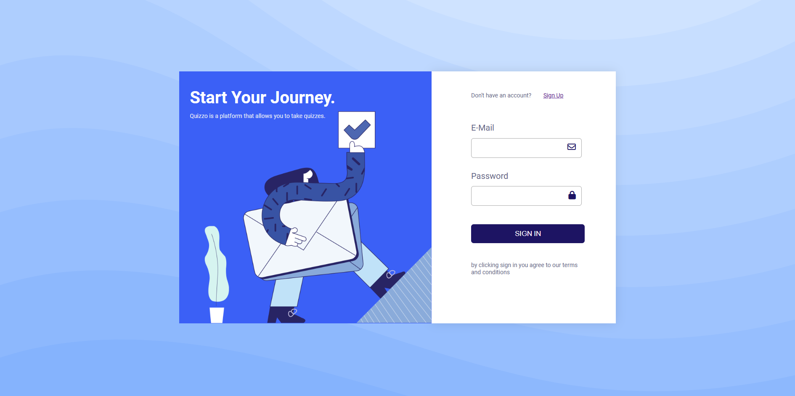
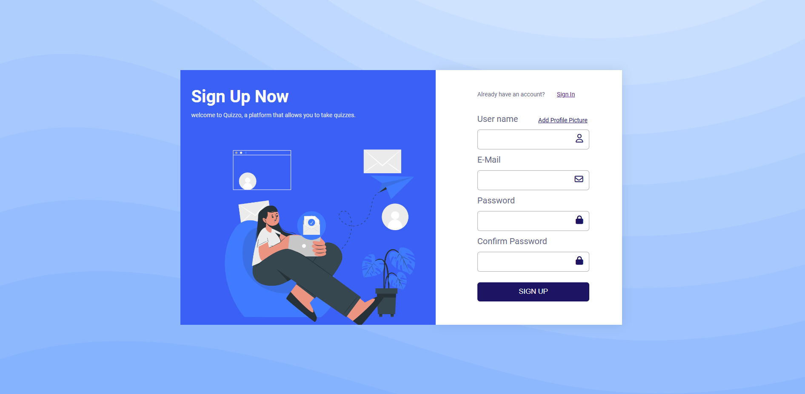
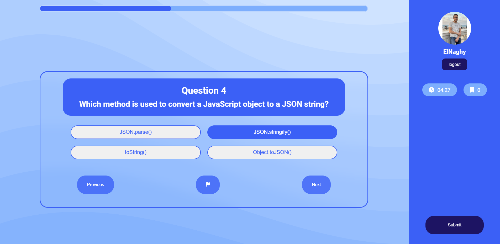
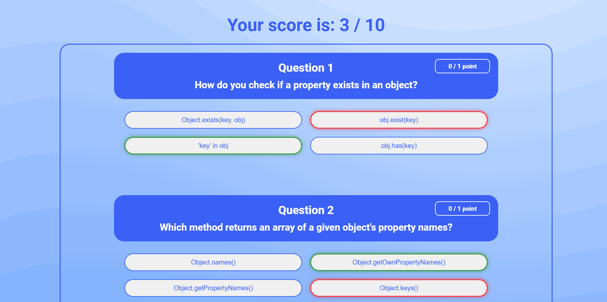

# 🌟 Quizzo - The Ultimate Responsive Web Quiz App

Welcome to **Quizzo**, a sleek, interactive, and fully responsive quiz platform where users can test their knowledge through a series of timed questions and receive real-time results. Whether you're looking to learn or just have fun, Quizzo makes the experience simple and enjoyable across all devices.

## 🌐 Live Demo

Check out the live version of Quizzo here: (https://zyadelnaghy.github.io/Quiz-App/)

## 🚀 Features

- 🔐 **Authentication System**: 
  - **Login Form**: Securely log in to access the quiz.
  - **Sign-Up Form**: New users can create an account quickly and easily.
  
- 📝 **Interactive Quiz Page**:
  - Answer multiple-choice questions designed for a fun and engaging experience.
  - **5-Minute Time Limit**: You have only 5 minutes to complete the quiz, adding a challenge to test your speed and knowledge.

- 📊 **Results Page**: 
  - Instantly view your quiz score with personalized feedback.

- 📱 **Responsive Design**: 
  - Fully optimized for desktop, tablet, and mobile devices for seamless user experience across all screen sizes.

## 🛠️ Built With

- **HTML5**: Structured and semantic markup for a modern web experience.
- **CSS3**: Responsive design with elegant, minimal styling.
- **JavaScript (ES6+)**: Dynamic behavior for a smooth, interactive user experience, including the 5-minute timer functionality.

## 💡 How It Works

1. **Sign Up**: Create a personalized account in seconds.
2. **Log In**: Access your account securely to start the quiz.
3. **Take the Quiz**: Answer a series of fun and challenging questions within a **5-minute time limit**.
4. **Get Results**: Instantly see your score and evaluate your performance.

## 📸 Screenshots

1. **Login Page**
 

3. **Sign-Up Page**  
 

4. **Quiz Page**
 

6. **Result Page**
 

## ⏳ Time Limit

To make the quiz more exciting, Quizzo has a **5-minute countdown timer**. If you don't complete the quiz in that time, the results will be automatically submitted based on the questions you've answered.

## 🔧 Installation & Setup

To get a local copy of Quizzo up and running, follow these simple steps:

### Prerequisites

You need a modern web browser like Chrome, Firefox, or Edge to run Quizzo. No additional software is required.

### Installation Steps

1. Clone the repository to your local machine:
   ```bash
   git clone https://github.com/ZyadElnaghy/Quiz-App.git
